# 🚀 基于主动式 NLI 意图推理与跨源 RAG 多智能体协同的企业知识文档智能问答系统

## 🎯 1. 项目概述

### 1.1 项目背景

项目聚焦企业知识管理中**"知识孤岛"分散、检索低效、决策支持薄弱**的三大痛点，基于 **NVIDIA NeMo Agent Toolkit** 框架，融合**主动式 NLI 意图推理**、**跨源 RAG 检索增强生成**、**MCP 多智能体协作**等前沿技术，开发了企业级智能知识问答系统。

### 1.2 核心创新

- **🧠 智能意图识别**：基于自然语言推理（NLI）三分类模型的主动式意图识别，支持多语言场景自适应与硬件感知资源动态分配
- **🔗 跨源知识融合**：构建"内部知识库语义检索 + 外部权威资源补充"的全维度 RAG 知识获取机制
- **🤖 多智能体协同**：基于 MCP 协议的标准化协作体系，实现主智能体与专家智能体的精准联动
- **⚡ 硬件优化加速**：采用 NVIDIA A100 GPU + CUDA 优化 + TensorRT 推理加速，确保系统实时响应

### 1.3 系统架构

系统包含**1个主智能体**和**3个专家智能体**：
- **主智能体**：任务解析与智能调度中枢
- **文档处理专家**：企业知识库管理（检索、插入、删除）
- **联网搜索专家**：外部权威资源补充
- **回答专家**：多源信息整合与输出

**在线体验**：http://chat.hks.free4inno.com/

## 🎯 2. 核心能力展示

### 2.1 主界面

主界面简洁明了，用户通过聊天框向智能体发送任务，包括但不限于提问、插入文档、删除文档...

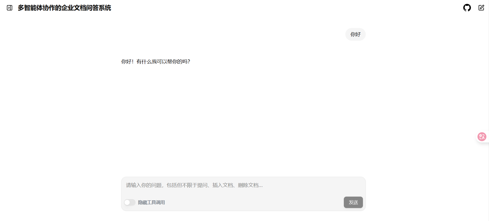

### 2.2 提问流程

#### 第一步：输入问题

在聊天框中直接输入问题，例如："请问NVIDIA NeMo Agent Toolkit是什么？"

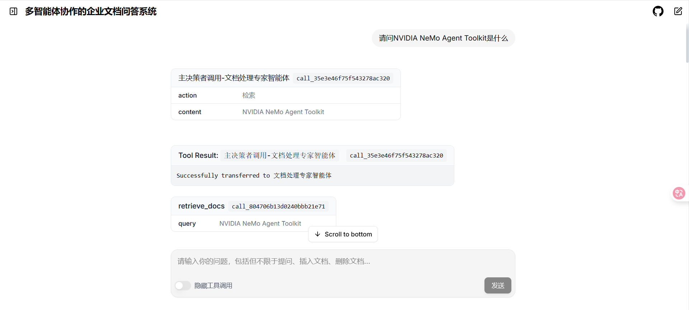

#### 第二步：主智能体调用文档处理专家

主智能体**自动分析**任务并分发给专家智能体。

对于提问类任务，**主智能体调用文档处理专家进行文档检索**。

当知识库中无相关文档时，**文档处理专家返回"未找到相关文档"**。

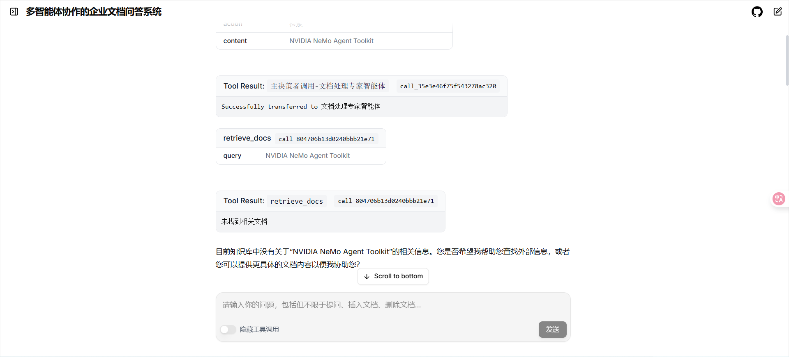

#### 第三步：主智能体调用联网搜索专家

主智能体收到"未找到相关文档"响应后，**调用联网搜索专家进行联网搜索**。（在主智能体提示词中配置：当文档处理专家未查询到相关文档或结果相关性不足时，调用联网搜索专家）

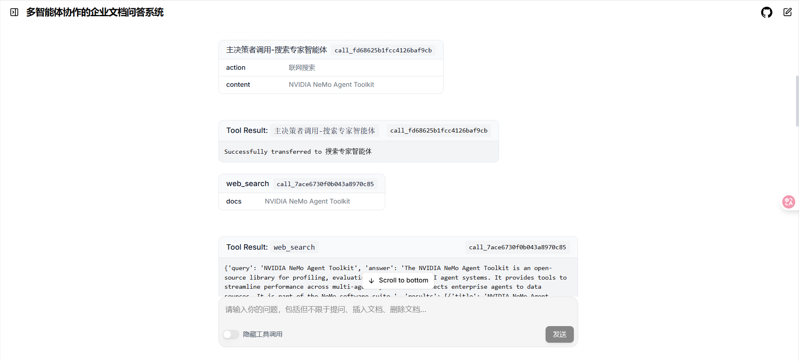
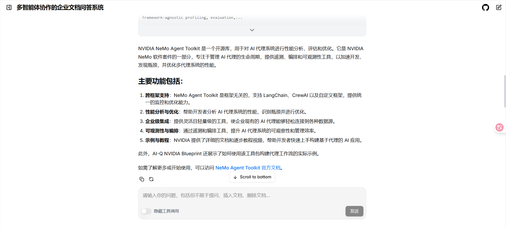

#### 第四步：主智能体调用回答专家

将文档处理专家检索到的知识或联网搜索结果作为**背景信息**，与**用户原始问题**一同发送给回答专家进行总结回答。

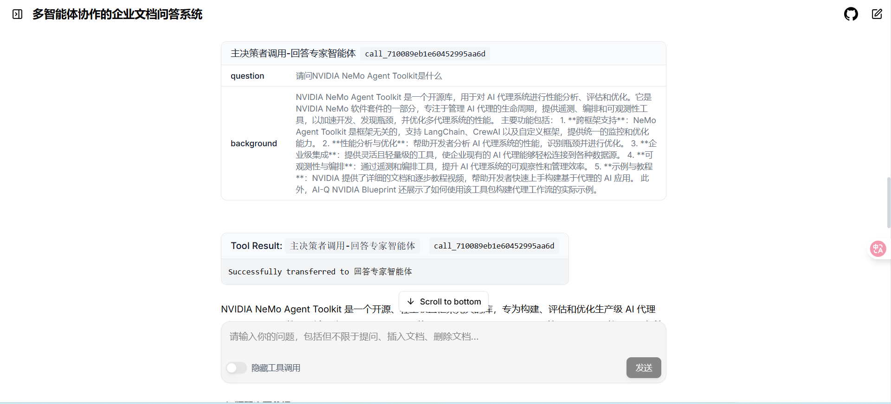
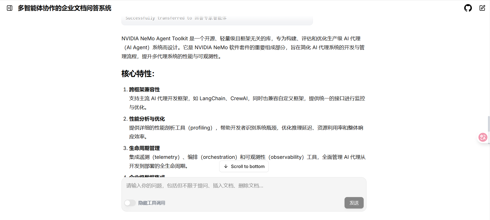


### 2.3 插入文档

用户可通过自然语言或文件上传方式插入文档。

示例输入："插入一条文档：NVIDIA NeMo Agent Toolkit是一款智能体开发框架"

**主智能体**调用**文档处理专家**进行**文档插入**，完成后将结果返回主智能体。

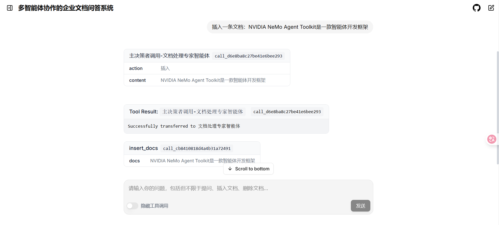
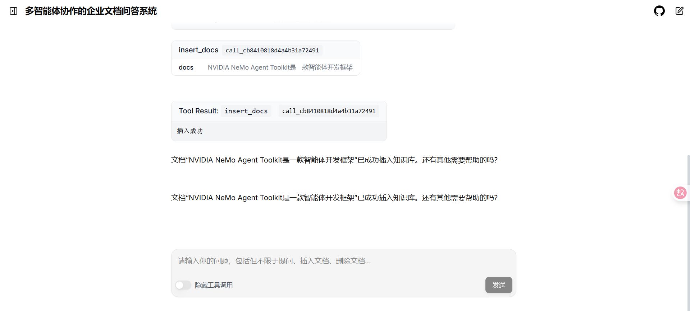

### 2.4 删除文档

用户可通过自然语言输入删除文档。

示例输入："删除文档，NVIDIA NeMo Agent Toolkit是一款智能体开发框架"

**主智能体**调用**文档处理专家**进行**文档删除**，完成后将结果返回主智能体。

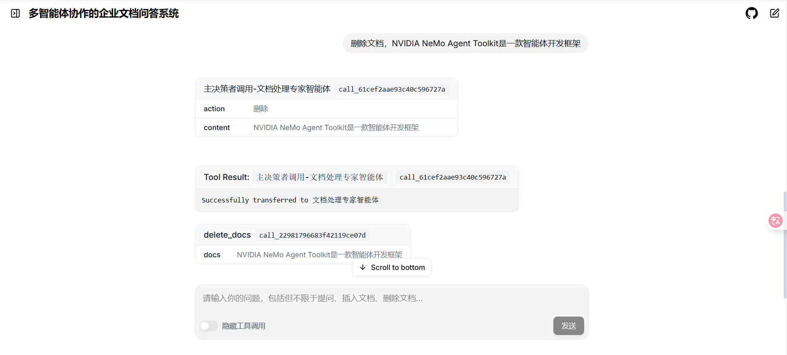
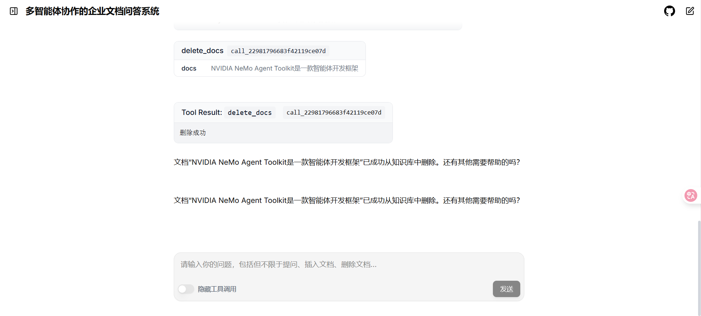


## 🏗️ 3. 技术架构与创新

### 3.1 整体架构设计

系统采用**"会话-请求-消息-智能体-反馈"**全链路解耦架构，通过 **Kafka 消息总线**实现异步通信：

- **用户交互层**：会话管理与需求输入
- **请求管理层**：需求解析与任务生成
- **消息总线层**：基于 Kafka 的异步通信
- **智能体执行层**：自举自荐 + 模型推理
- **反馈层**：多渠道结果传递


### 3.2 核心技术创新

#### 3.2.1 主动式 NLI 意图识别算法

- **多语言自适应**：基于 `langdetect` 自动语言检测 + 分语言模型池（中文：xlm-roberta-large-xnli，英文：roberta-large-mnli）
- **硬件感知优化**：PyTorch 原生 GPU/CPU 自动检测 + 线程池异步推理（ThreadPoolExecutor）
- **自举自荐机制**：NLI 三分类模型判断"任务-能力匹配度"，实现智能体自主任务接取

#### 3.2.2 跨源 RAG 知识获取机制

- **语义级精准检索**：Embedding 模型 + 向量数据库实现企业知识语义理解
- **智能补充策略**：内部检索不足时自动触发联网搜索，获取权威外部资源
- **知识融合生成**：RAG 技术整合内外部信息，生成准确完整的企业级回答

#### 3.2.3 MCP 标准化协作机制

- **统一交互协议**：定义标准化"任务指令格式"、"上下文传递规范"、"结果反馈模板"
- **动态任务分发**：基于意图识别结果的智能调度（文档操作类→文档专家，知识问答类→检索+搜索+回答流程）
- **上下文保持**：MCP 协议确保跨智能体任务传递时关键信息不丢失

### 3.3 智能体详细配置

#### 3.3.1 主智能体（调度中枢）

采用 **ReAct Agent** 架构，具备任务解析与动态调度能力：

```yaml
# 主智能体 - 基于意图识别的智能调度器
workflow:
  _type: react_agent
  tool_names: [document_expert, search_expert, answer_expert]
  llm_name: master_orchestrator
  verbose: true
  parse_agent_response_max_retries: 1
  system_prompt: |
    你是一位管理着一个由专业人工智能专家组成的团队的编排大师,负责接收用户请求并决定路由。
    您的团队由以下人员组成：
    1.document_export：文档处理专家
    2.search_expert：联网搜索专家
    3.answer_expert：回答专家
    请严格按照以下规则进行操作：
    - 如果用户请求是“插入文档/删除文档”，将请求交给【document_export】来插入或删除文档。无需加工文档内容。
    - 如果用户请求是“提出问题”，先调用【document_export】进行向量数据库检索。无需加工用户问题内容。
      - 如果文档处理专家返回的内容不足或不相关，再调用【search_expert】进行联网搜索。
    - 将最终检索或联网搜索结果交给【answer_expert】整理并回答。
   
    可用工具：{tools}
    
    你可通过以下两种格式之一进行回应。
    格式1：调用工具回答问题（严格使用）
    请严格使用以下格式来调用工具回答问题：
    Question: 你必须回答的输入问题
    Thought: 你应当始终思考该做什么
    Action: 需要执行的动作，必须是 [{tool_names}] 中的一个
    Action Input: 动作的输入内容（若无需输入，请注明 “动作输入：无”）
    Observation: 等待工具返回结果，切勿假设回应内容
    （此思考 / 动作 / 动作输入 / 观察结果可重复 N 次。）
    
    格式2：直接回答（无需工具时使用）
    当你获得最终答案后，请使用以下格式：
    Thought: 我现在知晓最终答案
    Final Answer: 原始输入问题的最终答案
```

### 3.3 文档处理专家

文档处理专家负责文档检索、向量数据库文档插入与删除。

配置文件如下：

```yaml
# 文档处理专家 - 基于向量数据库的语义检索
document_expert:
_type: tool_calling_agent
tool_names:
  - insert_docs
  - retrieve_docs
  - delete_docs
llm_name: expert_executor
verbose: true
handle_tool_errors: true
description: |
  我是一个文档处理专家，用于插入、删除、检索知识库中的文档。
  调用我时，输入格式如下：
  【插入/删除/检索】：具体文档内容，请输入用户的原始文档内容，无需加工
```

### 3.4 联网搜索专家

联网搜索专家在文档处理专家未检索到相关内容或结果相关性不足时，执行联网搜索。

配置文件如下：

```yaml
  # 专业智能体 - 联网搜索专家
  search_expert:
    _type: tool_calling_agent
    tool_names:
      - web_search
    llm_name: expert_executor
    verbose: true
    handle_tool_errors: true
    description: |
      我是一个联网搜索专家，当文档处理专家未检索到相关内容或结果相关性不足时，负责从互联网上检索信息并返回相关片段。
      调用我时，输入格式如下：
      【联网搜索】：需要联网搜索的内容
```

### 3.5 回答专家

回答专家根据文档处理专家检索内容或联网搜索结果，结合用户原始问题，生成总结性回答。

配置文件如下：

```yaml
# 回答专家 - 多源信息整合与企业级输出
answer_expert:
_type: react_agent
tool_names:
  - no_op_tool
llm_name: expert_executor
verbose: true
handle_tool_errors: true
system_prompt: |
  你是一个回答专家，用户会输入一个问题，并且带有文档处理专家检索到的相关知识或者联网搜索专家搜索到的相关背景知识。
  请你对用户原始问题+相关知识进行整理、总结，生成最终回答，请务必保证最终回答准确、全面、专业。
  工具：{tools}
  工具名称：{tool_names}
  此工具仅作占位，你无需调用工具。
  请严格使用以下格式回复：
  Thought: 我现在知晓最终答案
  Final Answer: 你最终生成的回答
description: |
  我是一个回答专家，负责根据文档处理专家或联网搜索专家返回的内容进行整理、总结，生成最终回答。
  调用我时，输入格式如下：
  【问题】：用户原始的问题
  【相关背景知识】：文档处理专家或联网搜索专家返回的相关知识
```


## 🚀 4. 快速启动

### 方式1：本地调试

```bash
# 1. 创建 Python 3.12 虚拟环境
uv venv --seed .venv --python 3.12

# 2. 安装核心依赖
uv pip install -e .                           # 基础框架
uv pip install -e .[langchain]               # LangChain 集成
uv pip install tavily-python                 # 联网搜索工具
uv pip install -e external/aiqtoolkit-server # 多智能体服务器

# 3. 安装 RAG 相关组件
uv pip install langchain langchain_chroma langchain_dashscope

# 4. 启动后端服务（支持多智能体协作）
aiq serve --config_file external\aiqtoolkit-server\src\my_multi_agent\configs\multi_agent_config.yml --host 0.0.0.0 --port 8001
# API 文档: http://localhost:8001/docs

# 5. 启动前端界面
cd external\aiqtoolkit-opensource-ui
npm install
npm run dev
# 前端页面: http://localhost:3000
```

#### 方式2：Docker 容器化部署

```bash
# 1. 构建并启动后端容器
docker build -t aiq-multi-agent:latest -f Dockerfile .
docker run -d --name aiq-backend \
  -p 8001:8001 \
  --gpus all \
  aiq-multi-agent:latest

# 2. 构建并启动前端容器
docker build -t aiq-frontend:latest \
  -f external/aiqtoolkit-opensource-ui/Dockerfile \
  external/aiqtoolkit-opensource-ui
docker run -d --name aiq-frontend \
  -p 3000:3000 \
  aiq-frontend:latest
```

## 📊 5. 技术特色总结

### 5.1 意图识别算法优势

- **自适应多语言支持**：自动检测中英文输入，匹配最优NLI模型
- **硬件感知优化**：动态适配GPU/CPU环境，确保推理效率
- **自举自荐机制**：智能体主动判断任务匹配度，提升协作精度

### 5.2 多智能体协作创新

- **标准化通信**：MCP协议统一智能体交互格式
- **动态任务分发**：基于意图识别的智能调度机制
- **跨源知识融合**：内部检索+外部搜索的全维度RAG

### 5.3 企业级应用价值

- **打破知识孤岛**：语义级检索整合分散知识资源
- **提升检索效率**：AI驱动的精准意图理解与响应
- **增强决策支持**：多源信息融合生成可信答案

---

**NVIDIA 2025 Hackathon 年度总决赛作品**

**团队**：自邮之翼-佛（北京邮电大学）

**核心技术**：NLI意图推理 + RAG检索增强 + MCP多智能体协作 + NVIDIA硬件加速